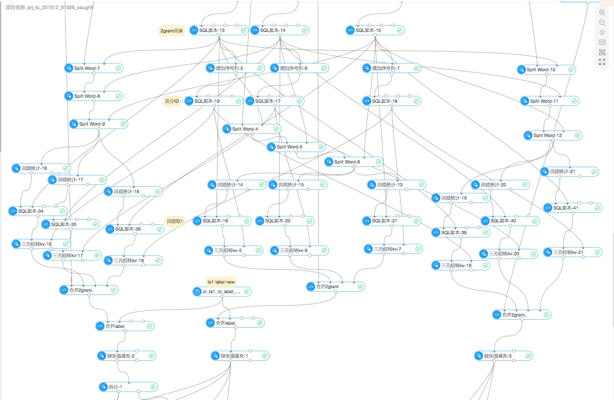
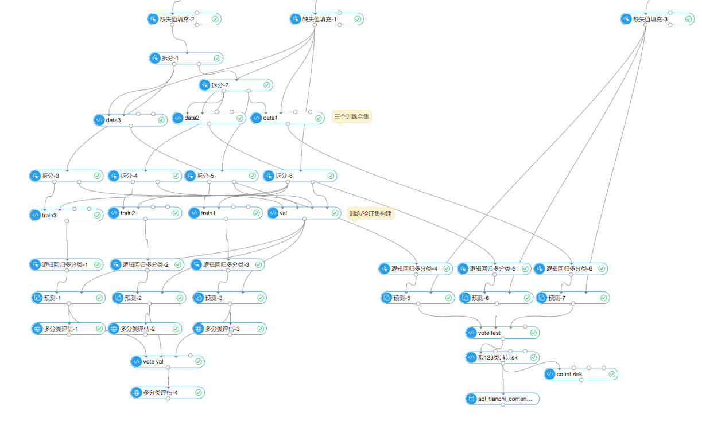

### 网页风险: 思路与 PAI 模型详情

team: MJ_3DSUN

#### 整体思路

* 使用带答案的第一季测试集作为训练数据.
* 对 html 进行预处理, 替换数字和网址等, 提取出四块文本 (详见 UDF)
  * title
  * body: 正文前 2000 字, 不包括链接文字和字数不大于 6 的html元素文本.
  * link: 字数大于 5 的长链接文字的拼接, 最多 80 个.
  * link_short: 字数不大于 5 的短链接文字的拼接, 最多取 40 个.
* 对以上四块分别取黑样本里文档频率 topN 的词, 作为特征. 按样本中是否包含该词, 特征取值为 1 或 0. 词表大小依次为: 3500, 15000, 15000, 4000.
* 对 title, bod, link 分别取黑样本里文档频率 topN 的 2gram, 作为特征, 取值为 1 或 0. 2gram 词表大小依次分别为: 3500, 15000, 15000.
  * 因为 PAI 里没找到对 ngram 进行各样本词频统计的功能, 所以采用了一种权宜的方法, 并不能很完整地捕捉 2gram. (详见后文)
* 以上共计 71000 维稀疏特征. 输入逻辑回归多分类模型进行训练.
* 把白样本拆分为三部分, 训练得到的三个模型做投票.


#### 数据预处理

```sql
-- 拉取带答案的第一季测试集 (作为训练数据), risk 转为 label
drop table if exists cr_ts1;
create table cr_ts1 as
  select id, html,
  (case when t2.risk='normal' then 0
        when t2.risk='fake_card' then 1
        when t2.risk='gambling' then 2
        else 3 end) as label
  from odps_tc_257100_f673506e024.adl_tianchi_content_risk_testing_phase1_with_answer;

-- 训练数据去重复
drop table if exists cr_ts1_norep;
create table cr_ts1_norep as
  select min(id), html, min(label)
  from cr_ts1
  group by html;

-- 从 html 中提取需要的文字
drop table if exists cr_ts1_raw_features;
create table cr_ts1_raw_features as
  select id, label,
  get_title_raw(html) as title_raw,
  get_links_raw(html) as link_raw,
  get_body(html) as body
  from cr_ts1_norep;

drop table if exists cr_ts1_text_features;
create table cr_ts1_text_features as
  select id, label, body,
  get_title(title_raw) as title,
  get_links(link_raw) as link,
  get_links_short(link_raw) as link_short,
  from cr_ts1_raw_features;

-- 分离黑白样本
drop table if exists cr_ts1_text_features_c0;  -- 白样本
create table cr_ts1_text_features_c0 as
  select * from cr_ts1_text_features
  where label = 0;
drop table if exists cr_ts1_text_features_c123;  -- 黑样本
create table cr_ts1_text_features_c123 as
  select * from cr_ts1_text_features
  where label <> 0;

-- 处理第二季测试集
drop table if exists cr_test_raw_features;
create table cr_test_raw_features as
  select id,
  get_title_raw(html) as title_raw,
  get_links_raw(html) as link_raw,
  get_body(html) as body
  from odps_tc_257100_f673506e024.adl_tianchi_content_risk_testing_phase2;

drop table if exists cr_test_text_features;
create table cr_test_text_features as
  select id, body,
  get_title(title_raw) as title,
  get_links(link_raw) as link,
  get_links_short(link_raw) as link_short,
  from cr_test_raw_features;

```

#### 文本特征提取: PAI 截图

文本特征提取的 PAI 流程见下图. 

- **图中左/中/右三部分分别为: 训练集白样本处理, 训练集黑样本处理, 测试集样本处理.**
  - 源头输入的表分别为: `cr_ts1_text_features_c0`, `cr_ts1_text_features_c123`, `cr_test_text_features`
- **其中每一部分又有四条支线, 分别为 title, link, link_short, body 四块文本.**




下面按图中的节点名称和顺序进行介绍, 并给出必要的 SQL 代码.

#### 文本特征提取: 1gram 部分

##### 分词

节点名称: Split Word-1,2,3
* 分词设定: 识别选项全选, 合并选项全不选, tokenizer 选 TAOBAO_CHN, 其余都不勾选.

##### 词频统计

分别对 title, link, link_short, body 四个字段进行词频统计.

##### 统计文档频率 topN 的词

节点名称: SQL脚本-1,2,3,4

```sql
select word, count(count) as count_sum from ${t1}
group by word order by count_sum desc limit 3500;
-- 对 title, link, link_short, body 分别取 3500, 15000, 4000, 15000
```

该脚本输出接一个"增加序号列"节点.

##### 区分不同字段的词表 ID

节点名称: SQL脚本-5,6,7

目的是在最后合并 kv 特征时避免 id 冲突.

```sql
select append_id + 10000 as append_id, word from ${t1};
-- 对 link, link_short, body, 这里分别加上 10000, 40000, 50000
```

##### 对词频统计结果进行处理

节点名称: SQL脚本-8,9,11,10 -24,25,26,27 -29,30,31,32

```sql
-- 输入1: 词频统计的输出
-- 输入2: topN 词 (即 SQL脚本-1,2,3,4 的输出)
select a.id, a.word, 1 as count -- 按文档频率统计, 因此词频取为1.
from ${t1} a
join ${t2} b on a.word = b.word;
```

##### 三元组转 kv

节点名称: 三元组转kv-1,2,3,4 -8,9,10,11 -12,13,14,15
* 输入1: 接上一步的 SQL脚本输出
* 输入2: 接区分了 ID 的词表 (即: "增加序列号-1", SQL脚本-5,6,7)

##### 合并 kv 特征

然后用 SQL 脚本合并这四块 kv 特征列. 对训练集黑/白样本, 用如下 SQL:

```sql
-- 图中节点名: 合并4.
select a.id,
a.key_value as kvtitle, 
b.key_value as kvlink, 
c.key_value as kvlink_short,
d.key_value as kvbod
from ${t1} a 
full outer join ${t2} b on a.id = b.id 
full outer join ${t3} c on a.id = c.id 
full outer join ${t4} d on a.id = d.id;
```

对测试集样本, 用如下 SQL
```sql
-- SQL脚本-57
select a.id,
b.key_value as kvtitle, 
c.key_value as kvlink, 
d.key_value as kvlink_short
from ${t1} a
full outer join ${t2} b on a.id = b.id
full outer join ${t3} c on a.id = c.id
full outer join ${t4} d on a.id = d.id;

-- SQL脚本-58
select a.*,
b.key_value as kvbod
from ${t1} a
full outer join ${t2} b on a.id = b.id;
```

#### 文本特征提取: 2gram 部分

##### 2gram-count

2gram count 仅针对 title, link, body 这三个字段.

先用 ngram-count 节点, 最大 N-gram 长度取2.
* 输入1: 分词结果 (Split Word-1,2,3)
* 输入2: topN 词 (SQL脚本-1,2,3,4)

再用 SQL脚本-13,14,15 分别统计各字段的最高频 topN 2gram:

```sql
select regexp_replace(words, ' ', '') as word from (
  select * from ${t1}
  where ngram = 2 and regexp_count(words, '.*[a-zA-Z，。[:punct:]]+.*') = 0
  order by count desc limit 3500) t;  -- 对 title, link, body 分别取 3500, 15000, 15000
```

##### 2gram 词表增加序号列并区分 ID

增加序号列节点: 增加序号列-5,6,7

区分 ID: SQL脚本-16,17,18

```sql
select append_id + 5000 as append_id, word  -- 对 title, link, body 分别取 5000, 25000, 65000
from ${t1};
```

##### 分词: 以 2gram 词表为自定义词典

分三步, 每一步对一个字段进行分词, 同时以该字段的 topN 2gram 词表作为自定义词典.
* 分词设定: 识别选项全选, 合并选项全不选, tokenizer 选 TAOBAO_CHN, 勾选"过滤全英文"和"过滤标点符号".
* 这种方式并不能完整地统计到所有的 2gram, 仅仅是一种权宜的方法.

##### 2gram 统计

节点名称: 词频统计-14,15,13

##### 2gram 统计结果处理

节点名称: SQL脚本-19,20,21. 34,35,36. 39,40,41.

```sql
-- 输入1: 2gram 词频统计结果
-- 输入2: 2gram 词表 (SQL脚本-13,14,15 的输出)
select a.id, a.word, 1 as count 
from ${t1} a
join ${t2} b on a.word = b.word;
```

##### 三元组转 kv

节点名称: 三元组转kv-5,6,7. 16,17,18. 19,20,21.
* 输入1: 上一步的输出
* 输入2: 区分了 ID 的 2gram 词表 (SQL脚本-16,17,18 的输出)

##### 把 2gram kv特征与之前的特征合并

节点名称: 合并2gram

```sql
-- 输入1: 1gram 合并列的结果 (图中节点 "合并4" 或 "SQL脚本-58" 的输出)
-- 输入2,3,4: 上一步三个字段的输出
select a.*,
b.key_value as kvtitle2, 
c.key_value as kvlink2,
d.key_value as kvbod2
from ${t1} a
left outer join ${t2} b on a.id = b.id
left outer join ${t3} c on a.id = c.id
left outer join ${t4} d on a.id = d.id;
```

训练数据进一步合并 label 列:
```sql
-- 输入1: "合并2gram" 的输出
-- 输入2: 表 cr_ts1_text_features
select a.*, b.label
from ${t1} a 
join ${t2} b on a.id = b.id;
```

#### 数据集构建, 分类器训练和预测



##### 缺失值填充

* 填充字段: kvlink, kvbod, kvtitle2, kvlink2, kvbod2
* configs: `kvtitle,null,0:0;kvtitle2,null,5000:0;kvlink,null,10000:0;kvlink2,null,25000:0;kvlink_short,null,40000:0;kvbod,null,50000:0;kvbod2,null,65000:0`

##### 数据集构建

* 训练集白样本三等分.
  * 图中节点: 拆分-1: 0.3333. 拆分-2: 0.5.
* 把三份白样本分别与全部黑样本合并, 得到三个训练数据集. 图中节点名: data1, data2, data3

##### 逻辑回归多分类与预测

稀疏输入. L1正则系数=3.

取三个模型预测结果进行投票:
```sql
select a.id,
decode(
  decode(a.prediction_result, 0, 1, 1, 10, 2, 100, 3, 1000)
  + decode(b.prediction_result, 0, 1, 1, 10, 2, 100, 3, 1000)
  + decode(c.prediction_result, 0, 1, 1, 10, 2, 100, 3, 1000),
  21, 1,
  30, 1,
  120, 1,
  201, 2,
  210, 2,
  300, 2,
  1110, 2,
  1020, 1,
  1200, 2,
  2001, 3,
  2010, 3,
  2100, 3,
  3000, 3,
  0
)
as prediction_result
from ${t1} a
join ${t2} b on a.id = b.id
join ${t3} c on a.id = c.id;
```

取出123类, 把 label 转为 risk, 最后写入 answer 表

```sql
select id,
  (case when prediction_result=0 then 'normal'
        when prediction_result=1 then 'fake_card'
        when prediction_result=2 then 'gambling'
        when prediction_result=3 then 'sexy' end) as risk
from ${t1}
where prediction_result <> 0;
```

